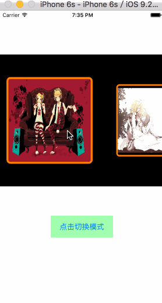
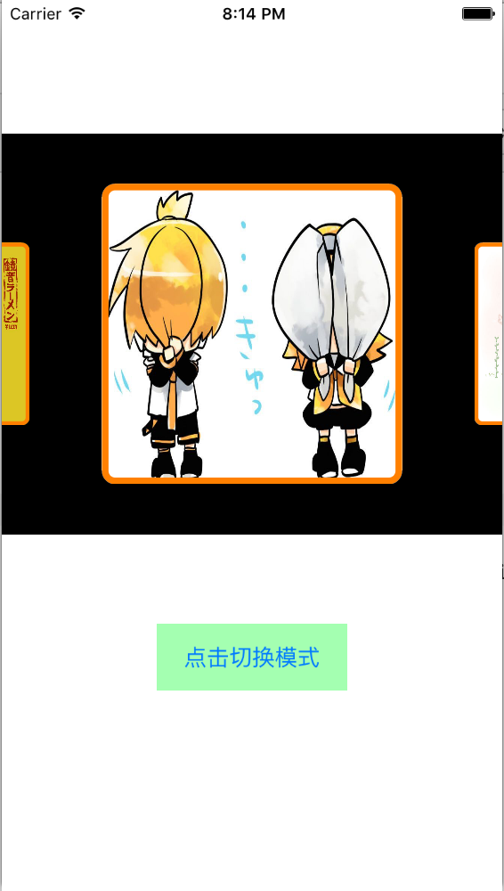
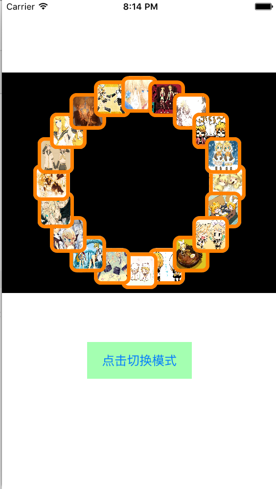
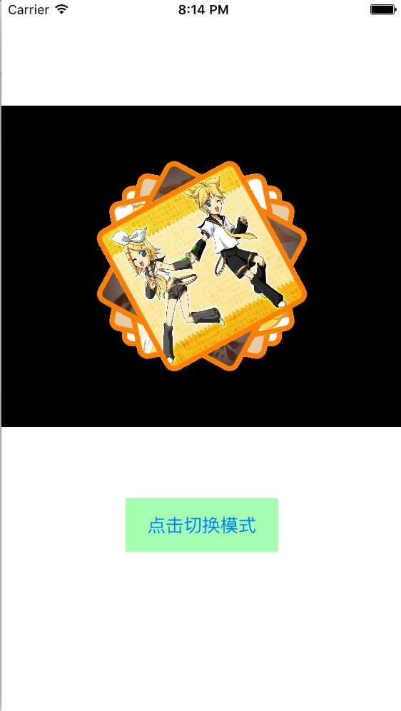

# MQPhotoLayoutDemo

用UICollectionViewLayout布局，实现不同效果

本Demo中包括线性布局、环形布局和扎堆布局

## 效果图如下



### 线性布局



### 环形布局



### 扎堆布局



### 使用说明
1.将对应的`Layout`文件拖拽进项目

在UICollectionView创建的时候对`Layout`进行初始化
```objc
<#MQLineLayout#> *layout = [[<#MQLineLayout#> alloc]init];

self.collectionView = [[UICollectionView alloc]initWithFrame:CGRectMake(0, 100, viewWidth, 300) collectionViewLayout:layout];
```
